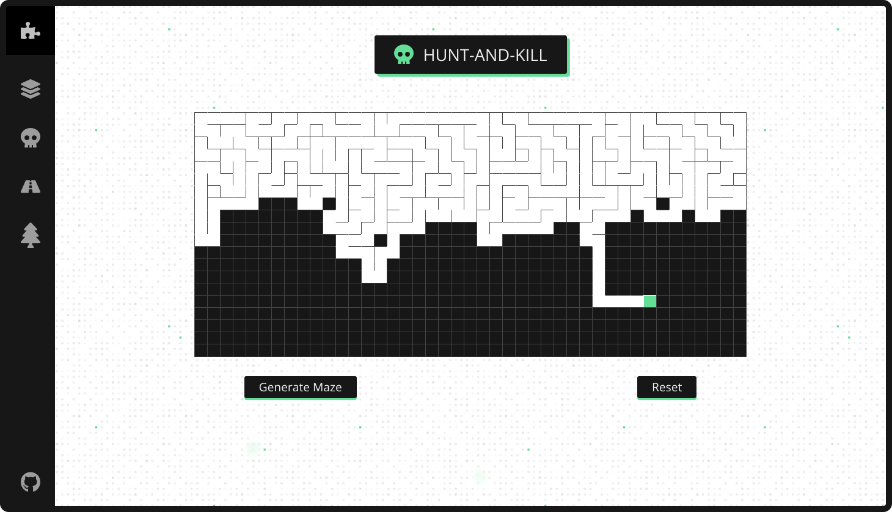

# MAZE GENERATOR
**Welcome to Maze generator !**
 It is a tool that helps you visualise how mazes are generated.

You can access it @ https://anuragsati.github.io/maze-generator

## Mazes
A maze is a complex structure of interconnected passageways. There should be (at least) one way to get from a designated start location to a designated end. Typically the path is convoluted and branched (these branches can also be branched, and often leading to dead-ends) making it not obvious to the naked eye the correct path to take (even when exposed to a God’s eye view from above with all information exposed).
 
Your can read more about mazes here : [Mazes](https://datagenetics.com/blog/november22015/index.html)

## Algorithms Used

### 1. Recursive Backtracker (Iterative version) 
The Recursive Backtracker Algorithm is probably the most widely used algorithm for maze generation. It has an implementation that many programmers can relate with (Recursive Backtracking). This algorithm requires memory that is proportional to the size of the Maze (O(n)).
 
This algorithm works by randomly walking through the maze until it can no longer go forward. Once this happens the walker takes one step back and tries another direction. This process continues until the walker is back at the starting location. The name is derived from this fact, as the walker is 'Backtracking' and repeating its actions recursively.

You can read more about this algorithm @ [Recursive Backtracker](https://en.wikipedia.org/wiki/Maze_generation_algorithm)

### 2. Hunt and Kill Algorithm
The Hunt and Kill algorithm is very similar to Recursive Backtracker. The only difference is how it handles dead ends. As this algorithm doesn't use recursion, it can avoid the potential stack overflows that plague the Recursive Backtracker for large mazes.
 
The algorithm picks a random location and starts a random walk. It continues to walk until it hits a dead end. At this point, the Recursive Backtracker would take a step back, but the Hunt and Kill Algorithm does something different. Instead of backtracking, it will scan the maze for an uncut cell at restart the walk process at that location. It continues this process until all cells have been cut.

You can read more about this algorithm @ [hunt and kill algorithm](https://people.cs.ksu.edu//~ashley78/wiki.ashleycoleman.me/index.php/Hunt_and_Kill_Algorithm.html)

### 3. Aldous-Broder Algorithm
The Aldous-Broder Algorithm is rarely the algorithm of choice for most generation problems. It is a very inefficient algorithm that in the theoretical worst case (ridiculously unlikely) will never finish. This algorithm can claim one thing that many other algorithms cannot. This algorithm generates a uniform spanning tree. It has a uniform chance of generating all possible spanning trees, most of the other algorithms have at least a minor bias.
 
Aldous-Broder works by randomly walking around the maze. It removes edges whenever it reaches a cell that it hasn't visited before. Unlike the Recursive Backtracker it doesn't consider visited cells when choosing the direction to walk, instead it always walks in a random direction. The random walk makes the algorithm inefficient, because it takes time to walk to every cell; however, without this mechanism it would not generate a uniform spanning tree. The main body of the algorithm is in the highlighted lines in the implementation below.

You can read more about this algorithm @ [Aldous-broder Algorithm](https://people.cs.ksu.edu//~ashley78/wiki.ashleycoleman.me/index.php/Aldous-Broder_Algorithm.html)

### 4. Binary Tree Algorithm
The Binary Tree Algorithm is likely the easiest to implement, and it requires the least amount of resources; however, because of this it has a very strong diagonal bias. The algorithm only require one cell in memory at a time, but the maze will 'point' to a diagonal. Anyone can follow the maze with the bias without hitting any dead ends; however, traveling the opposite direction of the bias will provide dead ends.
 
The Binary Tree Algorithm is one of the easiest to implement. This is in part the cause of the diagonal bias. For every cell in the maze, either wall is removed for one of the diagonal pairs. This cascades causing all the paths to lead towards that diagonal.

You can read more about this algorithm @ [Binary Tree Algorithm](https://people.cs.ksu.edu//~ashley78/wiki.ashleycoleman.me/index.php/Binary_Tree_Maze.html)

## Installation
1. Download the repository and open it in any text editor of your choice.
2. Install the packages with `npm install`
3. Run the server `npm run start`

## License
This product is licenced under [MIT](https://choosealicense.com/licenses/mit/).
